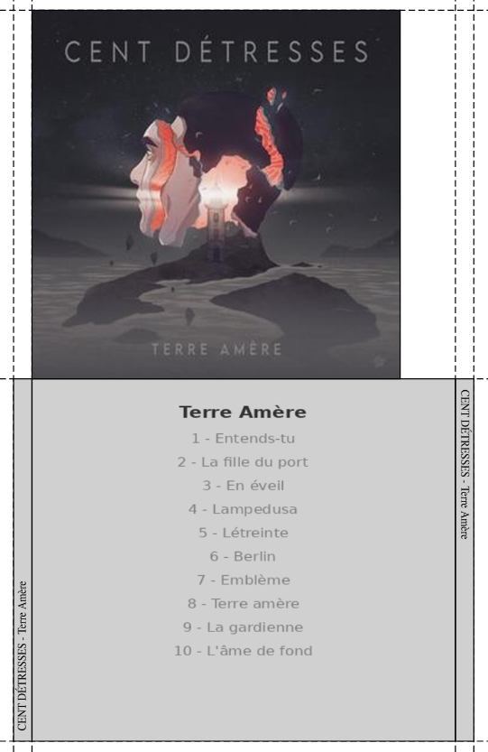
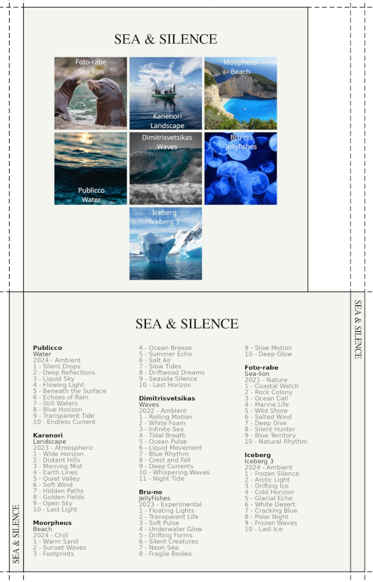
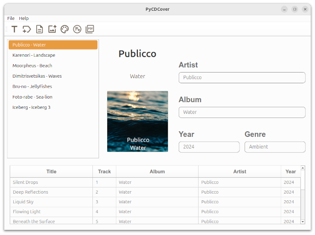

<p align="center">
  Français | <a href="README.md">🇬🇧 English</a>
</p>

# PyCDCover

# 1. Présentation

**PyCDCover** est un logiciel permettant de créer des jaquettes (pochettes) de CD audio à partir des informations d’un album  (auteur, titre, année, genre, image).

Le logiciel récupère automatiquement :

- les **tags** depuis les fichiers audio du CD ;
- les **images d’albums** depuis *iTunes* à partir des tags (artiste – album).

Si aucune image n’est trouvée, elle est remplacée par une **image orange** portant le nom de l’artiste et de l’album.  
Vous pouvez remplacer cette image par celle de votre choix (cadrée de préférence).
Langues: Français, Anglais, Espagnol, Breton

--- 

# 2. Illustrations

## 2.1 Exemple de jaquette maquette (1 CD)

Utilisé avec l’autorisation du groupe **CENT DÉTRESSES**  
@CENT DÉTRESSES

<p align="center">
  
</p>

## 2.2 Exemple de jaquette multi-albums

Les images sont extraites de Pixabay (licence Pixabay)
Ce sont donc des albums fictifs.

<p align="center">
  
</p>

## 2.3 Aperçu du logiciel

<p align="center">
  
</p>

---

# 3. Installations automatiques

## 3.1. Sous Windows

La dernière version stable de **PyCDCover** est disponible ici :  
👉 https://github.com/GerardLeRest/pycdcover-v2/releases

Téléchargez PyCDCover.Setup-X.X.X.exe  
(où X.X.X correspond au numéro de version, par exemple 2.2.1)

Vous pouvez ensuite passer à la section **5**.

---

## 3.2. Sous GNU/Linux

➡️ **PyCDCover est disponible au format *AppImage***.

Téléchargez `PyCDCover-X.X.X-x86_64.AppImage`  ( [Releases · GerardLeRest/pycdcover-v2 · GitHub](https://github.com/GerardLeRest/pycdcover-v2/releases))
(où *X.X.X* représente le numéro de version).

Rendez le fichier exécutable :

```bash
chmod +x PyCDCover-X.X.X-x86_64.AppImage
```

Lancez le programme :

```bash
./PyCDCover-X.X.X-x86_64.AppImage
```

Vous pouvez ensuite passer à la section **5**.

---

# 4. Version Python — GNU/Linux

*(Pour les utilisateurs souhaitant lancer PyCDCover depuis les sources.)*

## 4.1. Installer Python et les outils nécessaires

```bash
sudo apt update
sudo apt install python3 python3-pip python3-venv -y
```

## 4.2. Télécharger le programme

```bash
git clone git@github.com:GerardLeRest/pycdcover-v2.git
cd pycdcover-v2
```

## 4.3. Créer un environnement virtuel

```bash
python3 -m venv mon_env
```

### Activer l’environnement

```bash
source mon_env/bin/activate
```

### Installer les dépendances

```bash
pip install reportlab PySide6 pillow requests mutagen music-tag
```

## 4.4. Lancement

```bash
python3 pycdcover.py
```

---

# 5. Fonctionnement du programme

## 5.1. Fonctionnement avec recherche automatique des images

1. Préparer votre dossier avec vos musiques taguées. N'utilisez pas directement le lecteur CD à cause de ralentissement ou de bugs. Copiez alors votre CD dans un dossier.

2. Créez le **titre du CD** (1ʳᵉ icône à gauche).

3. **Récupérez les tags** (2ᵉ icône).

4. **Éditez les tags** si nécessaire (3ᵉ icône).
   
   **Très important** :  
   vérifiez ici les éventuelles erreurs.

5. **Téléchargez automatiquement les images** via iTunes (4ᵉ icône).

6. **Choisir la couleur de la pochette**

7. **Créez les faces avant et arrière** (5ᵉ icône).

8. **Générez le PDF** découpable et imprimable.

## 5.2. Jaquette non référencée sur le web

Une image orange (avec nom+album) apparaît si l'image d'un album n'a pas été trouvée internet. iTunes peut parfois fournir des images incorrectes.. Dans tous les cas en cas d'erreur concernant une image, voici la démarche à suivre:

Créer le titre → récupérer les tags MP3 → éditer MP3 → Télécharger les images → créer les deux faces → changer manuellement l’image voulue dans le dossier (1) → créer les deux faces → générer PDF

 (1) ~/PyCDCover/miniatures est le dossier des miniatures

Remarque importante : Respecter l'ordre ci-dessus pour ne pas se retrouver dans l'ancienne configuration

## 5.3 Albums doubles

Avec un album double, si aucune action n’est effectuée, deux images identiques apparaîtront sur la face avant. sur la face avant. Voici comment régler ce problème simplement:

Créer le titre → récupérer MP3 → éditer MP3 → Télécharger les images → créer les deux faces → Effacer l'image voulue dans le dossier (2)→ créer les deux faces → générer PDF

(2) ~/PyCDCover/miniatures est le dossier des miniatures

Remarque importante : Respectez l'ordre ci-dessus pour ne pas se retrouver dans l'ancienne configuration

---

# 6. Informations et licences

**PyCDCover – Générateur de jaquettes de CD audio**  
Auteur : Gérard LE REST  
Licence : GNU GPL v3  
© Gérard LE REST  
Email : ge.lerest@gmail.com  
Créé le : 01-04-2010  
Dernière mise à jour : 2026-01-15  

- [Page officiel](https://github.com/GerardLeRest/pycdcover-v2)
- [Documentation](https://doc.ubuntu-fr.org/pycdcover#liens)  
- [Page Internet](https://gerardlerest.github.io/pycdcover/)

---

# 7. Licences

**Droits d'images**

PyCDCover utilise l’API publique de Apple Inc. (iTunes Search API) pour récupérer automatiquement des images d’albums.

Ces images restent la propriété de leurs ayants droit.
Elles sont stockées localement d'une session à l'autre, utilisées uniquement dans un cadre privé.

Ce projet est indépendant et n’est ni affilié, ni approuvé par Apple Inc.
L’utilisateur est seul responsable de l’usage qu’il fait des images récupérées.

**Licence libre : GNU GPL v3 (ou version ultérieure)**

Ce programme est un logiciel libre : vous pouvez le modifier et le redistribuer selon les termes de la Licence publique générale GNU (GPL v3), version 3 ou toute version ultérieure.

Il est fourni **sans aucune garantie**, ni implicite ni explicite,  
concernant une valeur commerciale ou une adéquation à un usage particulier.

👉 [Consulter la licence GNU GPL v3](https://www.gnu.org/licenses/gpl-3.0.html)

---

# 8. Architecture du projet

- PySide6 : interface graphique
- ReportLab : génération PDF
- Mutagen : lecture des tags MP3
- Requests : API iTunes
- Architecture : modèle MVC (séparation logique métier / interface / contrôle)
