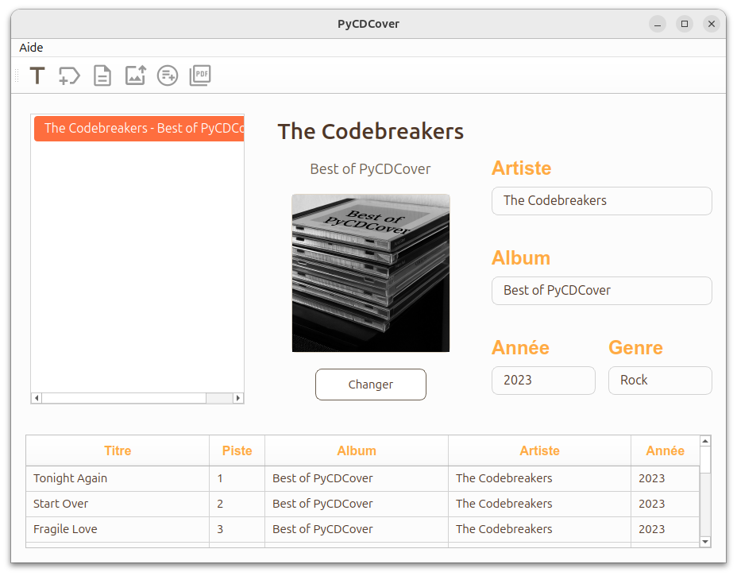
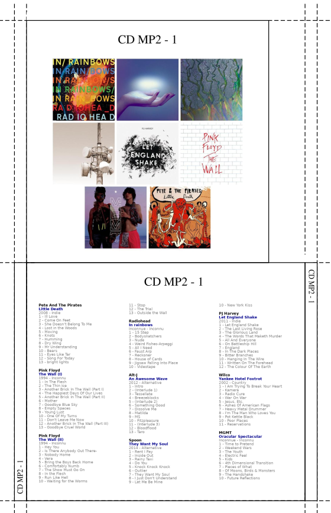

# Aperçu du logiciel

<p align="center">
  
</p>

## Exemple de jaquette maquette (1 CD)

Utilisé avec l’autorisation du groupe **CENT DÉTRESSES**  
@CENT DÉTRESSES

<p align="center">
  
</p>

## Exemple de jaquette multi-albums

Les images ci-dessous servent uniquement de démonstration.  
Elles sont distribuées à titre non commercial et en basse résolution.

<p align="center">
  
</p>

---

# 1. Présentation

**PyCDCover** est un logiciel permettant de créer des jaquettes de CD audio à partir des informations d’un album  
(auteur, titre, année, genre, image).

Le logiciel récupère automatiquement :

- les **tags** depuis les fichiers audio du CD ;
- les **images d’albums** depuis *iTunes* ou *MusicBrainz*, à partir des tags (artiste – album).

Si aucune image n’est trouvée, elle est remplacée par une **image orange** portant le nom de l’artiste et de l’album.  
Vous pouvez remplacer cette image par celle de votre choix (cadrée de préférence).

---

# 2. Installations automatiques

## 2.1. Sous Windows

La dernière version stable de **PyCDCover** est disponible ici :  
👉 https://github.com/GerardLeRest/pycdcover-v2/releases

Téléchargez **PyCDCover.Setup-X.X.X.exe**,  (x.x.x 2.2.1 -> version 2.2.1 de PyCDCover

Vous pouvez ensuite passer à la section **4**.

---

## 2.2. Sous GNU/Linux

➡️ **PyCDCover est disponible au format *AppImage***.

Téléchargez `PyCDCover-X.X.X-x86_64.AppImage`  ( [Releases · GerardLeRest/pycdcover-v2 · GitHub](https://github.com/GerardLeRest/pycdcover-v2/releases))
(où *X.X.X* représente le numéro de version).

Rendez le fichier exécutable :

```bash
chmod +x PyCDCover-X.X.X-x86_64.AppImage
```

Lancez le programme :

```bash
./PyCDCover-X.X.X-x86_64.AppImage
```

---

# 3. Version Python — GNU/Linux

*(Pour les utilisateurs souhaitant lancer PyCDCover depuis les sources.)*

## 3.1. Installer Python et les outils nécessaires

```bash
sudo apt update
sudo apt install python3 python3-pip python3-venv -y
```

## 3.2. Télécharger le programme

```bash
git clone git@github.com:GerardLeRest/pycdcover-v2.git
cd pycdcover-v2
```

## 3.3. Créer un environnement virtuel

```bash
python3 -m venv mon_env
```

### Activer l’environnement

```bash
source mon_env/bin/activate
```

### Installer les dépendances

```bash
pip install -r requirements.txt
```

## 3.4. Lancement

```bash
python3 pycdcover.py
```

---

# 4. Fonctionnement du programme

## 4.1. Fonctionnement avec recherche automatique des images

1. Préparer un dossier de musiques taguées. N'utilisez pas directement le lecteur CD.

2. Créez le **titre du CD** (1ʳᵉ icône à gauche).

3. **Récupérez les tags** via *MusicBrainz* ou *iTunes* (2ᵉ icône).

4. **Éditez les tags** si nécessaire (3ᵉ icône).
   
   ⚠️ **Très important** :  
   vérifiez ici les éventuelles erreurs et corrigez les titres trop longs.

5. **Téléchargez les images** (4ᵉ icône).

6. **Créez les images avant et arrière** (5ᵉ icône).

7. **Générez le PDF** découpable et imprimable.

---

## 4.2. Jaquette non référencée sur le web

Une image orange (avec nom+album) apparait si l'image d'un album n'a pas été trouvé internet. Le serveur peut parfois également se tromper. Dans tous les cas en cas d'erreur sur une image, voici la démarche à suivre:

Créer le titre → récupérer MP3 → éditer MP3 → récupérer les images dans le dossier* → créer les deux faces → changer manuellement l’image voulue → créer les deux faces → générer PDF

* ~/PyCDCover/thumbnails : dossier des miniatures

Remarque importante : Respecter l'ordre ci-dessus pour ne pas se retrouver dans l'ancienne configuration

---

## 4.3 Albums doubles

Avec un album double, si rien n'est fait, deux images en double apparaissent sur la face avant. Voici comment régler ce problème simplement:

Créer le titre → récupérer MP3 → éditer MP3 → récupérer les images dans le dossier* → créer les deux faces → Effacer l'image voulue → créer les deux faces → générer PDF

* ~/PyCDCover/thumbnails : dossier des miniatures

Remarque importante : Respecter l'ordre ci-dessus pour ne pas se retrouver dans l'ancienne configuration

---

# 5. Informations et licences

**PyCDCover – Générateur de jaquettes de CD audio**  
Auteur : Gérard LE REST  
Licence : GNU GPL v3  
© Gérard LE REST  
Email : ge.lerest@gmail.com  
Créé le : 01-04-2010  
Dernière mise à jour : 2026-01-15  

- [Page wiki Ubuntu](https://doc.ubuntu-fr.org/pycdcover#liens)  
- [Page internet](https://gerardlerest.github.io/pycdcover/)

---

# 6. Licence

**Licence libre : GNU GPL v3 (ou version ultérieure)**

Ce programme est un logiciel libre : vous pouvez le modifier et le redistribuer selon les termes de la  
Licence publique générale GNU (GPL v3), version 3 ou toute version ultérieure.

Il est fourni **sans aucune garantie**, ni implicite ni explicite,  
concernant une valeur commerciale ou une adéquation à un usage particulier.

👉 [Consulter la licence GNU GPL v3](https://www.gnu.org/licenses/gpl-3.0.html)
