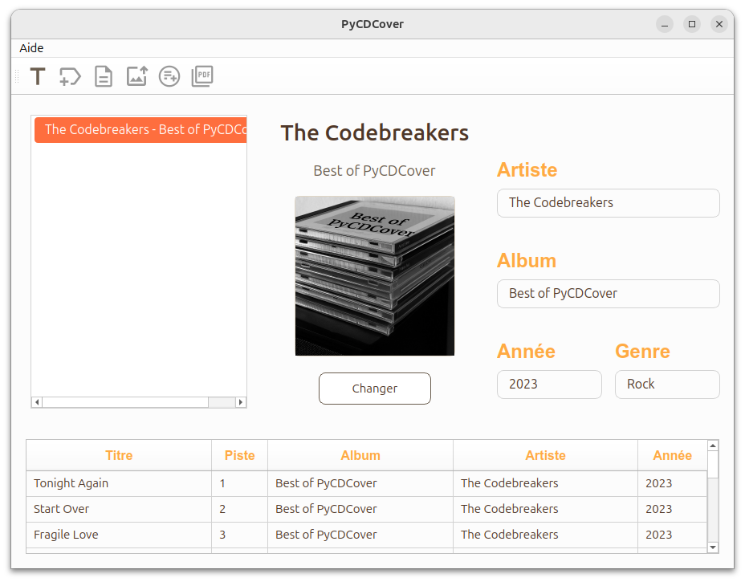
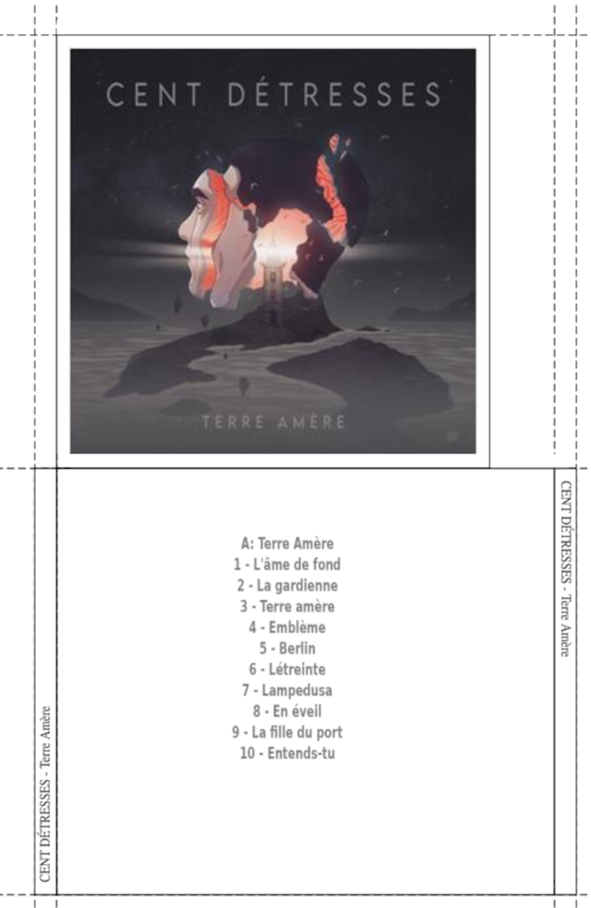
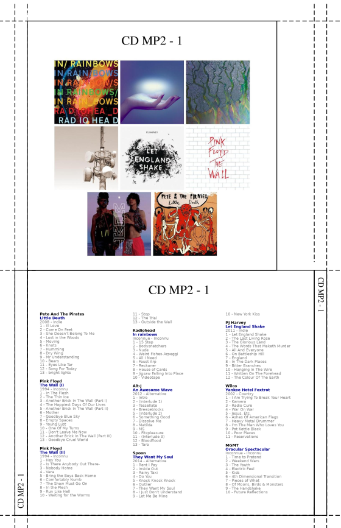

Documentation Française: [Doc - Français](README-fr.md)

# # Software Preview

<p align="center">
  
</p>

## Mock-up Cover Example (1 CD)

Used with permission from the band **CENT DÉTRESSES**  
@CENT DÉTRESSES

<p align="center">
  
</p>

## Multi-Album Cover Example

The images below are provided for demonstration purposes only.  
They are distributed for non-commercial use and in low resolution.

<p align="center">
  
</p>

---

# 1. Overview

**PyCDCover** is a software tool for creating audio CD covers from album information  
(author, title, year, genre, image).

The software automatically retrieves:

- **tags** from the audio files on the CD  
- **album images** from *iTunes* using the tags (artist – album)

If no image is found, it is replaced by an **orange placeholder image** showing the artist and album name.  
You can replace this image with one of your choice (preferably cropped).

**Languages: French, English, Spanish, Breton**

---

# 2. Automatic Installations

## 2.1. Windows

The latest stable version of **PyCDCover** is available here:  
👉 https://github.com/GerardLeRest/pycdcover-v2/releases

Download: `PyCDCover.Setup-X.X.X.exe`  
(where X.X.X is the version number, for example 2.2.1)

You can then proceed to section **4**.

---

## 2.2. GNU/Linux

➡️ **PyCDCover is available as an AppImage**

Download: `PyCDCover-X.X.X-x86_64.AppImage`  
👉 https://github.com/GerardLeRest/pycdcover-v2/releases  
(where X.X.X represents the version number)

Make the file executable:

```bash
chmod +x PyCDCover-X.X.X-x86_64.AppImage
```

Run the program:

```bash
./PyCDCover-X.X.X-x86_64.AppImage
```

---

# 3. Python Version — GNU/Linux

*(For users who want to run PyCDCover from source.)*

## 3.1. Install Python and required tools

```bash
sudo apt update
sudo apt install python3 python3-pip python3-venv -y
```

## 3.2. Download the program

```bash
git clone git@github.com:GerardLeRest/pycdcover-v2.git
cd pycdcover-v2
```

## 3.3. Create a virtual environment

```bash
python3 -m venv mon_env
```

### Activate the environment

```bash
source mon_env/bin/activate
```

### Install dependencies

```bash
pip install -r requirements.txt
```

## 3.4. Run

```bash
python3 pycdcover.py
```

---

# 4. Program Usage

## 4.1. With automatic image search

1. Prepare a folder containing your tagged music files. Do not use the CD drive directly due to possible slowdowns or bugs. Copy the CD to a folder first.

2. Create the **CD title** (1st icon on the left).

3. **Retrieve tags** via *iTunes* (automatic operation — 2nd icon).

4. **Edit tags** if necessary (3rd icon).
   
   ⚠️ **Very important:**  
   Check for any errors at this stage.

5. **Download images** (4th icon).

6. **Create front and back covers** (5th icon).

7. Generate the printable, cut-ready PDF.

---

## 4.2. Cover not referenced on the web

If an album image is not found online, an orange placeholder image (album + artist name) is used.  
iTunes may sometimes provide incorrect images. In case of error, follow this procedure:

Create title → retrieve MP3 tags → edit tags → download images → create both sides → manually replace the desired image in folder (1) → create both sides → generate PDF

(1) `~/PyCDCover/miniatures` is the thumbnails folder

Important note: Follow the order above to avoid reverting to the previous configuration.

---

## 4.3. Double albums

For double albums, duplicate images may appear on the front cover.  
To fix this:

Create title → retrieve MP3 tags → edit tags → download images → create both sides → delete the unwanted image in folder (2) → create both sides → generate PDF

(2) `~/PyCDCover/miniatures` is the thumbnails folder

Important note: Follow the order above to avoid reverting to the previous configuration.

---

# 5. Information and License

**PyCDCover — Audio CD Cover Generator**  
Author: Gérard LE REST  
License: GNU GPL v3  
© Gérard LE REST  
Email: ge.lerest@gmail.com  
Created: 2010-04-01  
Last update: 2026-01-15

- Ubuntu wiki page: https://doc.ubuntu-fr.org/pycdcover#liens  
- Website: https://gerardlerest.github.io/pycdcover/

---

# 6. License

**Free Software License: GNU GPL v3 (or later)**

This program is free software: you can redistribute it and/or modify it under the terms of the  
GNU General Public License (GPL v3), version 3 or any later version.

It is provided **without any warranty**, express or implied,  
including merchantability or fitness for a particular purpose.

👉 https://www.gnu.org/licenses/gpl-3.0.html
